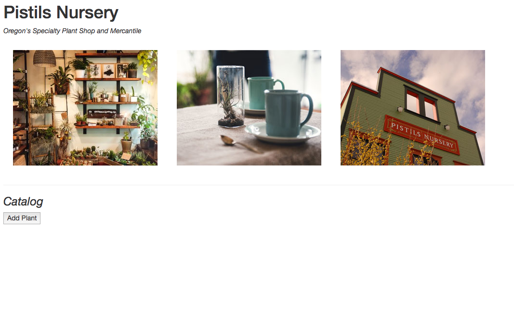
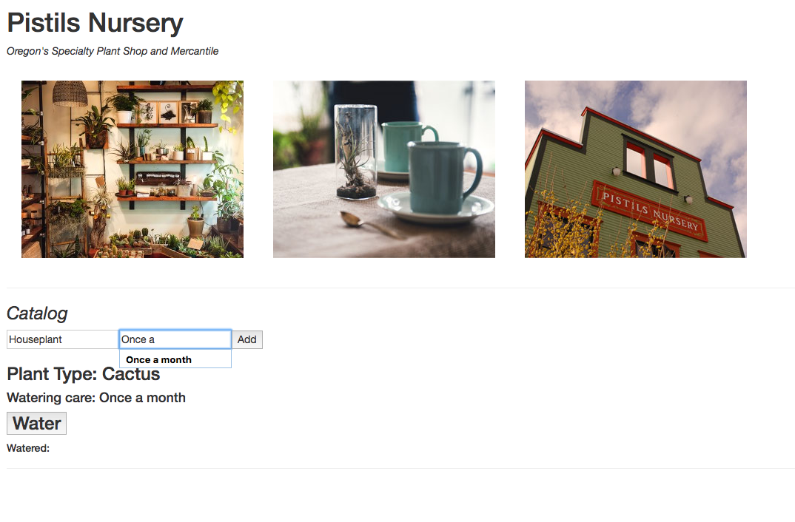
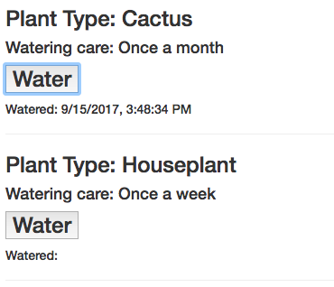

# Garden Store

By _Brittany Kerr_ [e-mail me](<mailto:kerrbrittany9@gmail.com>)

## Description

This web app is a practice in React.js and moment. It is a mock nursery admin page, in which the user can add a plant to their inventory by type and with individual watering instructions. The user can click a 'water' button to give the plants a timestamp and keep track of their plants' care.

Users can pretend to own a garden shop like Pistils Nursery in Portland!

Users can plants by type to their inventory.

Users click a button each time they water their plant to give it a timestamp and keep track.

## Prerequisites

You will need the following things properly installed on your computer:
* [Node.js](https://nodejs.org/) (with NPM)

## Installation

* Open Github site in your browser and copy: https://github.com/kerrbrittany9/nursery
* Open Terminal on your computer and follow these steps:
  * `$ cd desktop`
  * `$ git clone <paste repository-url>`
  * `$ cd nursery`
  * `$ npm install`

## Development server

Run `npm start` for a dev server. Navigate to `http://localhost:8080/`. The app will automatically reload if you change any of the source files.

## Technologies Used

React.js, JavaScript, Babel, Moment, react-hot-loader, webpack, Node.js, CSS, HTML
